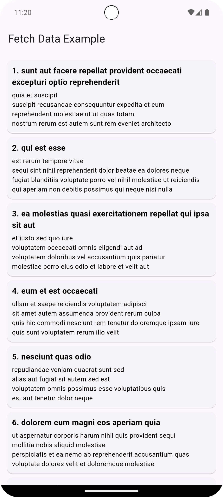

# Hướng dẫn Request API với Flutter bằng HTTP

Dưới đây là hướng dẫn request api cho Flutter, code ở file main.dart trong thư mục lib, ở đây tôi hướng dẫn kết nối với api __https://jsonplaceholder.typicode.com/posts__

## Installation

Bạn tạo một project Flutter trong một IDE như VScode hay Android Studio,...Tiếp theo bạn cần tải plug-in http
>__https://pub.dev/packages/http__

Bạn vào file __pubspec..yaml__ gán plug-in đó vào phần __dependencies__.
~~~yaml
dependencies:
  flutter:
    sdk: flutter

  # The following adds the Cupertino Icons font to your application.
  # Use with the CupertinoIcons class for iOS style icons.
  http: ^1.2.2
~~~
### Hoặc
Bạn có thể tải luôn plug-in sau vào __Terminal__
```bash
$ flutter pub add http
```
và bạn thêm thư viện sau vào file dart:
~~~dart
import 'package:http/http.dart' as http;
~~~

## Tổng quan
Hàm __fetchPost()__ thực hiện network request
```dart
Future<List<Post>> fetchPost() async {
  final response = await http.get(Uri.parse('https://jsonplaceholder.typicode.com/posts'));

  if (response.statusCode == 200) {
    List<dynamic> jsonData = jsonDecode(response.body);
    return jsonData.map((json) => Post.fromJson(json as Map<String, dynamic>)).toList();
  } else {
    throw Exception('Failed to load posts');
  }
}
```

Tạo lớp __Post()__ để khởi tạo, chuyển đổi những phản hồi từ server thành danh sách đối tượng trong Dart:
~~~dart
class Post {
  final int userId;
  final int id;
  final String title;
  final String body;

  const Post({
    required this.userId,
    required this.id,
    required this.title,
    required this.body,
  });

  factory Post.fromJson(Map<String, dynamic> json) {
    return Post(
      userId: json['userId'] as int,
      id: json['id'] as int,
      title: json['title'] as String,
      body: json['body'] as String,
    );
  }
}
~~~

Nạp dữ liệu bằng hàm __initState()__:
~~~dart
void initState() {
    super.initState();
    fetchPost().then((dataFromServer) {
      setState(() {
        postData = dataFromServer;
      });
    });
  }
~~~
Cuối cùng là tạo danh sách các post dưới dạng List View.<br/>


Chi tiết xem tại __https://docs.flutter.dev/__
